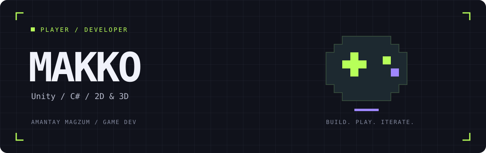

  

  <b>Gameplay code. Pixel art. One more playtest.</b>

---

### Hey, I'm Magzum — Makko online.

I make 2D and 3D games with **Unity and C#**. I use **Blender** and **Aseprite** for models, pixel art, and animation.

This is where I'm bringing together my older games and new projects: code, playable builds, and a look at how they work.

### My toolkit

| Code & gameplay | Art & animation |
| :--- | :--- |
| Unity · C# | Blender · Aseprite |

### What you'll find here

- **Game projects** — from small experiments to more complete games.
- **Gameplay systems** — the code behind movement, interactions, and mechanics.
- **Development notes** — what worked, what broke, and what changed after testing.

I'm adding projects over time. Each one will get its own description and instructions, so you can actually try it.

---

  Build something. Play it. Find the bug. Repeat.

